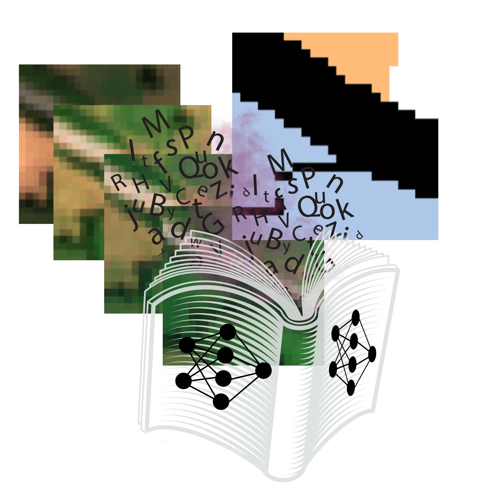

# 🤖Fusion of Computer Vision and Language Models for Knowledge Transfer in Precision Agriculture🌾
<p align="center">
  
</p>

**Authors**:  
Juan Ricardo Albarracín Barbosa  
Luis Ángel Oporto Añacato  
David Alexis García Espinosa  
**Advisor**: Dr. Gerardo Jesús Camacho González

## Overview

This project proposes a solution based on a **multimodal pipeline** that translates the visual outputs of **semantic segmentation models** into interpretable inputs for **large language models (LLMs)**. The goal is to enable effective crop analysis and facilitate knowledge transfer between different agricultural regions.

By combining computer vision and natural language processing, this approach seeks to enhance the decision-making process in precision agriculture and bridge the gap between visual data interpretation and actionable insights.


## Keywords

Precision Agriculture · Computer Vision · Semantic Segmentation · Large Language Models · Multimodal Systems · Knowledge Transfer

# Instructions to Set Up the Local Environment

1. **Create a new environment** with Python 3.10:
   ```bash
   conda create -n myenv python=3.10

2. **Activate the newly created environment**:
    ```bash
    conda activate myenv

3. **Install the dependencies from the requirements.txt file**:
    ```bash
    pip install -r requirements.txt

# Azure ML CLI Setup for GPU Training
In case you want to train in the cloud, this guide covers creating a workspace, environment, compute cluster, and submitting training jobs on GPU:
1. **Install and Set Up Azure ML CLI**:
    ```bash
    pip install azure-cli
    az login
    az extension add -n ml

2. **Create a Resource Group and Workspac**: (skip this step if you already have it)
    ```bash
    az group create --name my-resource-group --location eastus
    az ml workspace create --name my-workspace --resource-group my-resource-group

3. **Register the Custom Environment**: (skip this step if you already have it)
    ```bash
    az ml environment create --file env/conda.yaml

4. **Create a GPU Compute Cluster**: (skip this step if you already have it)
    ```bash
    az ml compute create \
    --name gpu-t4-nvidia \
    --size Standard_NC4as_T4_v3 \
    --max-instances 1 \
    --type amlcompute

5. **Submit a Training Job**:
   ```bash
   az ml job create \
   --file job.yml \ 
   --resource-group my-resource-group \ 
   --workspace-name my-workspace \   
   --web

